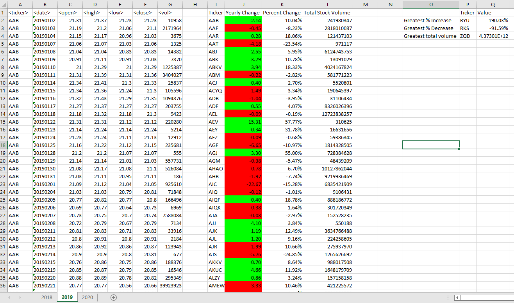

# The VBA of Wall Street

## Macros

Excel Macros have been created to:
1. Summarize ticker symbols per year with their yearly change, percent change and total stock volume
2. Summarize maximum values for % increase, % decrease, and total volume per year
3. Apply summary macros (1 & 2) across all sheets automatically

## Approach
### Summarize data for tickers
- A for loop is used to iterate through rows of ticker data
- For each row, if the ticker for the current row is the same as the following row, values for stock volume and yearly opening price are calculated.
- Once a change in ticker symbol is detected, the macro records the closing price and ticker name and calculates the rounded values for yearly change and percent change.
- Values for the ticker symbol, yearly change, percent change, and stock volume are printed to the current sheet.
- Formatting is applied to highlight positive yearly changes in green and negative changes red. The number of decimals in the yearly change column is set to two.
- Finally, variables used for calculations are reset, and the number of the row to print the summary data is incremented, ready to record summary stats for the next ticker symbol in the dataset.

### Find maximum amounts across a year
- Another for loop is used, this time to iterate through the newly created ticker summary table to identify the greatest % increase and decrease in yearly open vs closing prices and the greatest total volume of stock traded.
- The data for the current row is compared against stored values for each of these three measures. If the current row's value surpasses the stored value, it is then saved as the greatest value of that measure along with the name of the ticker symbol.
- The results are printed after the for loop is complete, with percentage values formatted as such.

### Run macros across all years: 2018-2020
- A for loop was used to iterate through all worksheets
- Macros to summarize tickers and maximum amounts were run for the active sheet
- If the index of the active sheet was not equal to the total number of sheets available in the workbook then the next sheet would be activated.
- Else, the macro would return to the first sheet in the workbook.

## Outputs
### 2018

### 2019

### 2020
